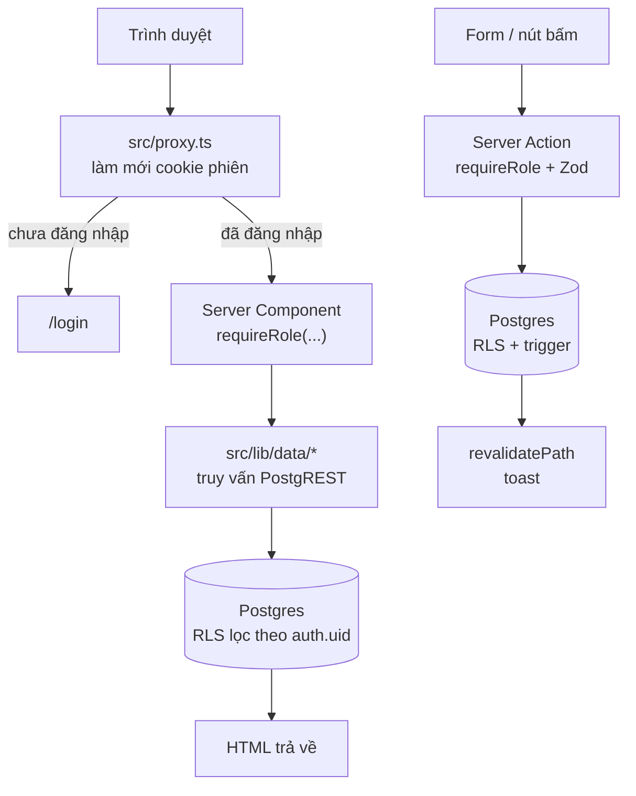

# Kiến trúc

## Nguyên tắc chủ đạo

`../../docs/demo-features.md` đặt ra một yêu cầu chi phối toàn bộ thiết kế:

> Các quyền trên phải được kiểm tra ở server/database, không chỉ filter ở frontend.

Vì vậy mọi quy tắc phân quyền được đặt ở **tầng thấp nhất có thể diễn đạt được
nó**. Tầng trên chỉ làm cho trải nghiệm dễ chịu hơn, không phải nơi giữ an toàn.

| Tầng | Nơi | Quyết định điều gì | Có phải lớp bảo mật? |
| --- | --- | --- | --- |
| RLS policy | `supabase/migrations/…_rls.sql` | **Hàng** nào được đọc/ghi | ✅ Có |
| Trigger | `supabase/migrations/…_triggers.sql` | **Cột** nào mỗi bên được ghi | ✅ Có |
| Storage policy | `supabase/migrations/…_storage.sql` | File nào được đọc/ghi | ✅ Có |
| Server Action | `src/lib/actions/` | Kiểm role, validate, thông báo lỗi | ✅ Có (lớp thứ hai) |
| Server Component | `src/app/(app)/**` | `requireRole` trước khi render | ✅ Có (lớp thứ hai) |
| Proxy | `src/proxy.ts` | Redirect sớm, làm mới session | ❌ **Không** |

`src/proxy.ts` cố tình không phải lớp bảo mật: nó chỉ tránh cho người dùng nhìn
thấy màn hình trắng. Bỏ qua nó hoàn toàn thì vẫn không đọc được dữ liệu của
người khác, vì RLS mới là ranh giới thật.

## Stack

| Thành phần | Phiên bản | Ghi chú |
| --- | --- | --- |
| Next.js | 16.3.3 | App Router, Turbopack. Middleware đã đổi tên thành **Proxy** |
| React | 19.2.8 | Server Components, Server Actions, `useActionState` |
| TypeScript | 5.x | `strict: true` |
| Tailwind CSS | 4.x | Cấu hình bằng CSS (`@theme inline`), không có `tailwind.config` |
| shadcn/ui | base `radix`, preset `nova` | Nguồn nằm trong `src/components/ui/` |
| Supabase | `@supabase/ssr` 0.12 · `supabase-js` 2.112 | Auth + Postgres + Storage |
| Zod | 4.x | Validate đầu vào của Server Action |
| PGlite | 0.5 (devDependency) | Postgres WASM cho `npm run db:test` |

## Luồng một request



Điểm cần nhớ: **layout không phải ranh giới bảo mật**. `src/app/(app)/layout.tsx`
có gọi `requireUser()`, nhưng khi điều hướng phía client vào một route con thì
layout không chạy lại. Vì thế **mỗi page tự gọi `requireRole()`**, và dưới nữa
RLS vẫn chặn lần thứ ba.

## Bản đồ route

Mọi route đều render động (`ƒ`) vì đều đọc cookie phiên.

| Route | Vai trò | Nguồn dữ liệu |
| --- | --- | --- |
| `/` | mọi vai trò | Chuyển hướng theo `HOME_PATH[role]` |
| `/login` | công khai | — |
| `/student` | student | `getStudentClass`, `getStudentAssignments` |
| `/student/assignments` | student | `getStudentAssignments` |
| `/student/assignments/[assignmentId]` | student | `getStudentAssignmentDetail` |
| `/teacher` | teacher | `getTeacherClasses` |
| `/teacher/classes/[classId]` | teacher | `getTeacherClassDetail` |
| `/teacher/assignments` | teacher | `getTeacherAssignments` |
| `/teacher/assignments/[assignmentId]` | teacher | `getTeacherAssignmentDetail` |
| `/parent` | parent | `getChildren` |
| `/parent/children/[studentId]` | parent | `getChildDetail` |
| `/parent/notifications` | parent | `getNotifications` |
| `/profile` | mọi vai trò | `requireUser` + dữ liệu theo vai trò |

Vào nhầm route của vai trò khác thì `requireRole` chuyển về trang chủ của chính
mình — không báo lỗi, vì người dùng không có gì để sửa. Vào đúng route nhưng sai
`id` thì query trả `null` và page gọi `notFound()`: **id không tồn tại và id
không được phép nhìn là không phân biệt được**, nên không rò rỉ thông tin.

## Cấu trúc thư mục

```
src/
├── proxy.ts                    Làm mới phiên, redirect sớm (KHÔNG phải lớp bảo mật)
├── app/
│   ├── layout.tsx              Font Be Vietnam Pro, Toaster, lang="vi"
│   ├── page.tsx                Điều hướng theo vai trò
│   ├── error.tsx               Error boundary toàn cục
│   ├── not-found.tsx
│   ├── login/                  page + login-form + demo-accounts
│   └── (app)/                  Nhóm route cần đăng nhập
│       ├── layout.tsx          requireUser + AppShell
│       ├── student/  teacher/  parent/  profile/
├── components/
│   ├── ui/                     shadcn/ui — sửa tại chỗ, không tạo bản sao
│   ├── layout/                 AppShell, TopBar, BottomNav, nav-config
│   ├── assignments/            AssignmentCard, SubmitForm, SubmissionSummary
│   ├── teacher/                CreateAssignmentDialog, GradeDialog, ProgressCard
│   ├── parent/                 NotificationList
│   └── shared/                 PageHeader, EmptyState, StatusBadge, useActionToast
└── lib/
    ├── supabase/server.ts      Client theo từng request (đọc cookie)
    ├── supabase/client.ts      Client cho trình duyệt
    ├── auth.ts                 getCurrentUser · requireUser · requireRole
    ├── data/                   Truy vấn đọc, tách theo vai trò
    ├── actions/                Server Actions (ghi)
    ├── database.types.ts       Kiểu của schema public (có Relationships)
    ├── format.ts               Ngày giờ, điểm, chữ cái viết tắt
    └── now.ts                  requestTime() — đọc đồng hồ ngoài lúc render

supabase/
├── migrations/                 4 file: schema → rls → triggers → storage
├── seed.sql                    Tài khoản và dữ liệu demo
└── tests/                      Bộ test chạy trên PGlite
```

## Ranh giới Server / Client

Mặc định là Server Component. Chỉ đánh `"use client"` khi thật sự cần trạng thái
trình duyệt:

| Client Component | Lý do |
| --- | --- |
| `login-form.tsx`, `submit-form.tsx` | `useActionState` + trạng thái `pending` |
| `create-assignment-dialog.tsx`, `grade-dialog.tsx` | Dialog đóng/mở |
| `top-bar.tsx`, `bottom-nav.tsx` | `usePathname` để tô mục đang xem |
| `notification-list.tsx` | `useTransition` khi đánh dấu đã đọc |
| `error.tsx` | Yêu cầu của Next.js |

`SubmissionSummary` **là Server Component** dù nằm trong danh sách render lặp:
nó phải tạo signed URL, và URL đó chỉ tồn tại với người mà RLS cho phép đọc file.

Tabs của shadcn là Client Component, nhưng nội dung bên trong vẫn được render ở
server và truyền vào dưới dạng `children` — nhờ vậy không phải đẩy dữ liệu xuống
client chỉ để chuyển tab.

## Tầng dữ liệu (`src/lib/data/`)

Mọi file đều mở đầu bằng `import "server-only"` để không bao giờ lọt vào bundle
trình duyệt.

### FK hint cho PostgREST — bắt buộc

PostgREST giải quyết `parent(child(...))` qua foreign key, và **từ chối query khi
có nhiều hơn một đường**. Nó đếm ba loại: FK trực tiếp theo mỗi chiều, và một
quan hệ many-to-many suy ra từ bảng nối có khóa chính đúng bằng hai FK của nó.

`class_students` khiến `classes` và `users` thành một cặp như vậy — điều không
nhìn thấy được nếu chỉ đọc riêng một trong hai bảng. Nên phải viết:

```ts
// ĐÚNG
.select("classes(id, name, teacher:users!classes_teacher_id_fkey(id, name, email))")

// SAI — PGRST201 lúc chạy, tsc và eslint đều không thấy
.select("classes(id, name, teacher:users(id, name, email))")
```

`npm run db:test` tự suy ra tập cặp mơ hồ **từ chính schema** rồi đối chiếu với
mọi `.select()` trong `src/lib/data/`. Xem [database.md](database.md#cặp-quan-hệ-mơ-hồ).

### Lọc trên bảng nhúng

`.eq("submissions.student_id", id)` lọc **hàng con**, không lọc hàng cha — đúng
ý muốn khi cần "mọi bài tập, kèm bài nộp của riêng em này". RLS thường đã lọc
sẵn; điều kiện này chỉ làm ý định hiện rõ trong code.

## Server Actions (`src/lib/actions/`)

Mọi action theo cùng một khuôn:

```ts
export async function doSomething(
  _previous: ActionState,
  formData: FormData,
): Promise<ActionState> {
  await requireRole("teacher");           // 1. vai trò
  const parsed = schema.safeParse({...}); // 2. validate bằng Zod
  if (!parsed.success) return failure(parsed.error.issues[0]?.message ?? "…");

  const supabase = await createClient();
  const { error } = await supabase.from("…").insert({...}); // 3. RLS kiểm lần nữa
  if (error) return failure("thông điệp tiếng Việt dễ hiểu");

  revalidatePath("/teacher", "layout");   // 4. làm mới
  return success();
}
```

`ActionState` là `{ error: string | null; ok?: boolean }`. Vì `success()` trả về
object mới mỗi lần, `useActionToast` phân biệt được từng lần thành công và bắn
toast đúng một lần — kể cả khi StrictMode chạy effect hai lượt.

Server Action gọi được bằng POST trực tiếp, không chỉ qua UI. Đó là lý do bước 1
và 3 không được bỏ.

## Xác thực

- `signInWithPassword` → đọc `role` từ `public.users` → `redirect(HOME_PATH[role])`.
- `getCurrentUser()` dùng `supabase.auth.getUser()` chứ không dùng `getSession()`:
  `getUser()` xác thực lại token với máy chủ Auth nên cookie giả không qua được.
  Bọc trong `cache()` nên mỗi lần render chỉ trả phí một lần.
- Tham số `?next=` được lọc qua `safeNext()`: chỉ nhận đường dẫn cùng gốc, chặn
  cả `//evil.test` lẫn `/\evil.test`.

## Giao diện

Theo `../../docs/AI_AGENT_GUIDELINES.md`, tóm tắt phần đã áp dụng:

- **Mobile-first.** Kiểm ở 320 / 360 / 375 / 390 / 430 / 768 / 1024 px.
- **BottomBar** hiện trên mobile, ẩn từ `md`. Nội dung có `pb-24 md:pb-12` để
  không bị che. Footer thì ngược lại: `hidden md:block`.
- **Vùng chạm ≥ 44px.** `TabsList` của shadcn mặc định cao 32px nên đã được sửa
  thành `h-11` ngay trong `src/components/ui/tabs.tsx`.
- **Không Card lồng Card.** Danh sách dùng `<section>` + heading, mỗi mục là một
  Card ngang hàng.
- **Chỉ dùng design token** (`text-muted-foreground`, `bg-card`, `border-border`…).
  Không hardcode mã màu, không gradient.
- Nhãn dài trong lưới chật được bọc `<span className="truncate">` để
  `whitespace-nowrap` không đẩy tràn ngang ở 320px.

Font là **Be Vietnam Pro** — có subset `vietnamese` đầy đủ, khác với Geist mặc
định của shadcn.

## Múi giờ

Toàn ứng dụng hiển thị theo `Asia/Ho_Chi_Minh`, cố định trong `src/lib/format.ts`.

Ô `<input type="datetime-local">` trả về chuỗi không có múi giờ (`2026-08-30T15:00`).
`localInputToIso()` gắn `+07:00` vào đó: giáo viên gõ 15:00 nghĩa là 15:00 giờ
Việt Nam, bất kể server đặt ở đâu. Việt Nam không có DST nên độ lệch cố định này
là chính xác chứ không phải xấp xỉ.

## Đọc đồng hồ

Quy tắc `react-hooks/purity` của ESLint cấm gọi `Date.now()` trong thân component.
Dùng `await requestTime()` từ `src/lib/now.ts` — giá trị "bây giờ" thành thứ mà
render *nhận vào*, thay vì thứ render tự sinh ra.
