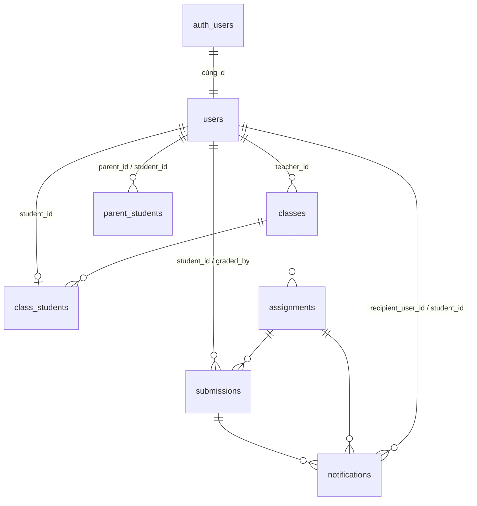

# Cơ sở dữ liệu

Bốn file migration, chạy đúng thứ tự tên file:

| File | Nội dung |
| --- | --- |
| `20260826000100_schema.sql` | Enum, bảng, ràng buộc, trigger toàn vẹn vai trò |
| `20260826000200_rls.sql` | Hàm helper + toàn bộ RLS policy |
| `20260826000300_triggers.sql` | Khóa cột, đóng dấu thời gian, sinh thông báo |
| `20260826000400_storage.sql` | Bucket `submissions` + policy trên `storage.objects` |

`seed.sql` chạy sau cùng và **chạy lại được** — nó tự dọn dữ liệu demo cũ.

## Sơ đồ quan hệ



## Enum

```sql
user_role         = 'student' | 'teacher' | 'parent'
submission_type   = 'file' | 'link'
notification_type = 'assignment_created' | 'grade_created' | 'grade_updated'
```

## Bảng

### `users`

Hồ sơ ứng dụng, dùng chung `id` với `auth.users`. Mật khẩu **không** nằm ở đây —
Supabase Auth giữ nó ở `auth.users.encrypted_password`. Dùng chung `id` là thứ
khiến `auth.uid()` viết thẳng được trong policy.

| Cột | Kiểu | Ghi chú |
| --- | --- | --- |
| `id` | uuid PK | → `auth.users(id)` ON DELETE CASCADE |
| `username` | text | unique |
| `email` | text | unique |
| `name` | text | |
| `role` | user_role | |
| `created_at` | timestamptz | |

### `classes`

| Cột | Kiểu | Ghi chú |
| --- | --- | --- |
| `id` | uuid PK | |
| `name` | text | |
| `teacher_id` | uuid | → `users(id)` **ON DELETE RESTRICT** |
| `created_at` | timestamptz | |

`RESTRICT` nghĩa là không xóa được giáo viên khi họ còn lớp. Đây là lý do
`seed.sql` phải xóa `classes` trước `auth.users`.

### `class_students` · `parent_students`

Bảng nối, khóa chính là cặp khóa ngoại. `class_students` có thêm unique index
trên `student_id` — hiện thực hóa *"Một Student thuộc một Class"*. Bỏ index đó
là đủ để mở đường cho một học sinh học nhiều lớp.

### `assignments`

| Cột | Ghi chú |
| --- | --- |
| `class_id` | → `classes(id)` CASCADE |
| `title` | CHECK không được rỗng sau khi trim |
| `description` | nullable |
| `due_at` | timestamptz |

### `submissions`

Tối đa một bài nộp cho mỗi cặp (bài tập, học sinh) — `unique (assignment_id, student_id)`.

| Ràng buộc | Ý nghĩa |
| --- | --- |
| `submissions_payload_check` | `file` thì phải có `storage_path` và không có `external_url`; `link` thì ngược lại |
| `submissions_score_range` | `score` trong khoảng 0–10 |
| `submissions_graded_consistency` | `graded_at`, `graded_by`, `score` cùng null hoặc cùng không null |

`score` là `numeric(4,2)`.

### `notifications`

| Cột | Ghi chú |
| --- | --- |
| `recipient_user_id` | Người nhận |
| `student_id` | Học sinh mà thông báo nói về |
| `assignment_id` / `submission_id` | nullable, tùy loại |
| `is_read` | mặc định `false` |

`notifications_target_check` bảo đảm `assignment_created` thì có `assignment_id`
và không có `submission_id`; hai loại điểm thì phải có `submission_id`.

## Toàn vẹn vai trò

Khóa ngoại một cột không nói được *"và người này phải là giáo viên"*, còn CHECK
constraint thì không đọc được bảng khác. Trigger `public.assert_user_role()` làm
việc đó, nhận tên cột và vai trò mong đợi qua `TG_ARGV`:

| Trigger | Bảo đảm |
| --- | --- |
| `classes_teacher_must_be_teacher` | `classes.teacher_id` trỏ tới một `teacher` |
| `class_students_student_must_be_student` | Chỉ học sinh vào được danh sách lớp |
| `parent_students_parent_must_be_parent` | |
| `parent_students_student_must_be_student` | |
| `submissions_student_must_be_student` | |
| `submissions_grader_must_be_teacher` | `graded_by` phải là giáo viên |

> **Vì sao không dùng khóa ngoại ghép `(id, role)`?**
> Cách đó khai báo được ràng buộc ngay trong DDL, nhưng PostgREST có thể không
> suy ra được quan hệ để nhúng (`embed`) qua khóa ngoại nhiều cột. Đổi lấy sự
> chắc chắn ở tầng API, ràng buộc vai trò được chuyển sang trigger.

## Phân quyền theo hàng (RLS)

RLS bật trên **cả bảy** bảng. Không có policy nghĩa là không có quyền.

### Hàm helper

Tất cả đều `STABLE SECURITY DEFINER SET search_path = ''`. `SECURITY DEFINER` là
điều bắt buộc: nó cho phép policy trên `users` tra `class_students` mà RLS không
đệ quy ngược vào chính nó.

| Hàm | Trả lời câu hỏi |
| --- | --- |
| `current_app_role()` | Tôi là vai trò gì? |
| `teaches_class(class_id)` | Tôi có phụ trách lớp này? |
| `teaches_assignment(assignment_id)` | Bài tập này thuộc lớp tôi phụ trách? |
| `teaches_student(student_id)` | Học sinh này học lớp tôi phụ trách? |
| `is_parent_of(student_id)` | Tôi là phụ huynh của học sinh này? |
| `studies_in_class(class_id)` | Tôi có học lớp này? |
| `has_child_in_class(class_id)` | Con tôi có học lớp này? |
| `can_view_class(class_id)` | Hợp của ba câu trên |
| `can_view_assignment(assignment_id)` | `can_view_class` của lớp chứa bài tập |
| `is_teacher_of_my_class(user_id)` | Người này là giáo viên của lớp tôi (hoặc lớp con tôi)? |

### Policy

| Bảng | Policy | Ai |
| --- | --- | --- |
| `users` | SELECT | Bản thân · giáo viên ↔ học sinh của mình · phụ huynh ↔ con · học sinh/phụ huynh → giáo viên của lớp |
| `classes` | SELECT | `can_view_class` |
| `class_students` | SELECT | Chính học sinh · giáo viên của lớp · phụ huynh |
| `parent_students` | SELECT | Cả hai phía · giáo viên của học sinh |
| `assignments` | SELECT | `can_view_class` |
| `assignments` | INSERT / UPDATE / DELETE | Giáo viên của lớp đó |
| `submissions` | SELECT | Chính học sinh · giáo viên phụ trách · phụ huynh |
| `submissions` | INSERT | Chính học sinh, chưa có điểm, và phải học lớp chứa bài tập |
| `submissions` | UPDATE (học sinh) | Bài của mình **và** `graded_at is null` |
| `submissions` | UPDATE (giáo viên) | Bài thuộc lớp mình phụ trách |
| `notifications` | SELECT / UPDATE | Chỉ người nhận |

`users` và `classes` **chỉ đọc** — tài khoản và lớp do quản trị viên tạo.
`notifications` **không có policy INSERT**: chỉ trigger `SECURITY DEFINER` sinh
ra được, nên không ai tự tạo thông báo cho mình.

Một hệ quả cố ý: **học sinh không nhìn thấy bạn cùng lớp**, chỉ thấy bản thân và
giáo viên. Đúng với *"Student chỉ được xem lớp, bài tập và bài nộp của chính mình"*.

## Phân quyền theo cột (trigger)

RLS quyết định được hàng nào, nhưng không diễn đạt được *"được sửa cột này, không
được sửa cột kia"*. `guard_submission_update` (BEFORE UPDATE) làm việc đó:

| Người sửa | Bị ghi đè về giá trị cũ | Được sửa |
| --- | --- | --- |
| Học sinh (`auth.uid() = old.student_id`) | `score`, `feedback`, `graded_at`, `graded_by` | `submission_type`, `storage_path`, `external_url` — và `updated_at` tự đóng dấu |
| Giáo viên | `submission_type`, `storage_path`, `external_url`, `updated_at` | `score`, `feedback` — `graded_at = now()`, `graded_by = auth.uid()` tự đóng dấu |

Với cả hai, `id`, `assignment_id`, `student_id`, `submitted_at` là bất biến.

Mọi UPDATE của giáo viên đều được coi là hành động **chấm bài**, nên thiếu điểm
sẽ bị từ chối:

```
ERROR: Cần nhập điểm khi chấm bài.
```

Đây cũng là lý do `seed.sql` phải tạm tắt `submissions_stamp_insert` khi muốn
lùi ngày nộp, thay vì UPDATE sau khi insert.

Các trigger còn lại:

| Trigger | Việc |
| --- | --- |
| `submissions_stamp_insert` | Đóng dấu `submitted_at`/`updated_at` phía server, để client không giả được thời điểm nộp nhằm qua deadline |
| `notifications_guard_update` | Người nhận chỉ đổi được `is_read`, mọi cột khác bị khôi phục |
| `assignments_notify_parents` | AFTER INSERT → tạo thông báo `assignment_created` cho phụ huynh của từng học sinh trong lớp |
| `submissions_notify_parents` | AFTER UPDATE → `grade_created` lần đầu, `grade_updated` các lần sau; chỉ bắn khi điểm hoặc nhận xét thật sự đổi |

## Storage

Bucket **private** `submissions`, giới hạn 10 MB.

Key có dạng `{assignment_id}/{student_id}/{uuid}-{tên-file}` — chính đường dẫn là
thứ policy dùng để xác thực, qua `storage.foldername(name)`.

| Policy | Ai |
| --- | --- |
| INSERT | Học sinh, vào đúng thư mục của mình, và phải xem được bài tập đó |
| UPDATE / DELETE | Học sinh sở hữu thư mục, nhưng không được đụng file đang gắn với bài đã chấm |
| SELECT | Học sinh sở hữu · giáo viên phụ trách bài tập · phụ huynh của học sinh |

`public.safe_uuid(text)` bọc phép ép kiểu: một đoạn đường dẫn do người dùng đặt
tên không được phép làm policy văng lỗi. Trả `null` thì mọi so khớp đều false.

`public.can_mutate_submission_object(text)` cho phép dọn file nháp/orphan và file
chưa chấm, nhưng khóa file mà `submissions.storage_path` vẫn đang trỏ tới sau
khi `graded_at` đã có giá trị.

Ứng dụng không bao giờ phát URL công khai — `signSubmissionFile()` tạo signed URL
sống 10 phút, và chỉ tạo được cho người mà RLS cho phép đọc object.

## Cặp quan hệ mơ hồ

PostgREST từ chối nhúng khi giữa hai bảng có nhiều hơn một đường quan hệ. Suy ra
từ schema hiện tại:

| Cha → con | Số đường |
| --- | --- |
| `classes` → `users` | 2 (FK `teacher_id`, và M2M qua `class_students`) |
| `users` → `classes` | 2 |
| `notifications` → `users` | 2 (`recipient_user_id`, `student_id`) |
| `parent_students` → `users` | 2 (`parent_id`, `student_id`) |
| `submissions` → `users` | 2 (`student_id`, `graded_by`) |
| `users` → `users` | 4 (qua `parent_students`) |
| và các chiều ngược lại | |

Nhúng những cặp này **bắt buộc** phải ghi rõ tên khóa ngoại:
`users!classes_teacher_id_fkey(...)`.

`npm run db:test` tự tính lại bảng trên từ `pg_constraint` rồi soát mọi
`.select()` trong `src/lib/data/` — không phải danh sách chép tay, nên thêm bảng
mới là nó tự cập nhật.

## Khác biệt so với `../../docs/schema.ts`

| # | Đặc tả | Triển khai | Vì sao |
| --- | --- | --- | --- |
| 1 | `User.encryptedPassword` | Nằm ở `auth.users.encrypted_password` | Supabase Auth đã giữ nó, đúng tên cột. Dùng chung `id` để `auth.uid()` dùng được trong RLS |
| 2 | `NotificationType` có 2 giá trị | Thêm `assignment_created` | `demo-features.md` yêu cầu báo phụ huynh khi có bài tập mới; enum gốc không diễn đạt được |
| 3 | `Notification.submissionId` bắt buộc | Cho phép null, thêm `assignment_id` | Hệ quả của #2 — thông báo bài tập mới chưa có bài nộp để trỏ tới. CHECK constraint giữ đúng cột cho đúng loại |
| 4 | `camelCase` | `snake_case` | Quy ước Postgres/Supabase; `src/lib/database.types.ts` phản ánh đúng bảng thật |

Ngoài ra: `score` là `numeric(4,2)` ràng buộc 0–10, và `class_students` có unique
index trên `student_id`.
